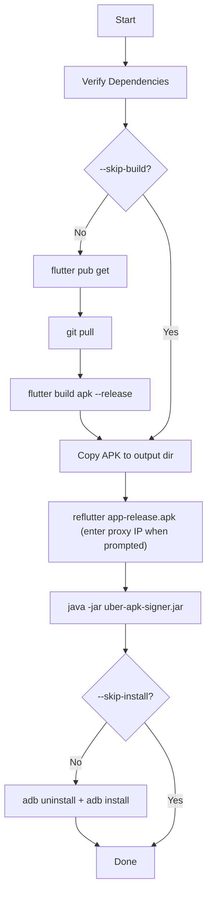

# Flutter IMS — ReFlutter Instrumentation Guide

> **Purpose:** Patch the Flutter IMS release APK to intercept HTTPS traffic via Burp Suite using ReFlutter.
> **Scope:** Your own app (`com.example.imsapp`) — for security testing and debugging only.

---

## Project Details

| Field | Value |
|---|---|
| **Project Path** | `/media/yajju/DATA/NIMS/Flutter-IMS` |
| **Package Name** | `com.example.imsapp` |
| **Entry Point** | `lib/main.dart` |
| **APK Output** | `build/app/outputs/apk/release/app-release.apk` |
| **Scripts Folder** | `scripts/` |

---

## Quick Start (TL;DR)

```bash
# 1. Install all dependencies (run once)
bash scripts/install_dependencies.sh

# 2. Run the full instrumentation pipeline
bash scripts/instrument_flutter_app.sh
```

> [!IMPORTANT]
> When ReFlutter prompts for a proxy host, enter your **laptop's Wi-Fi IP address** (the script displays it at startup).

---

## Step 1 — Install Dependencies

```bash
cd /media/yajju/DATA/NIMS/Flutter-IMS
bash scripts/install_dependencies.sh
```

### What this installs

| Package | Purpose |
|---|---|
| `git`, `curl`, `wget`, `unzip` | Core utilities |
| `python3`, `python3-pip` | Required for ReFlutter |
| `openjdk-17-jre` | Required for Uber APK Signer |
| `android-tools-adb` | Android Debug Bridge |
| `reflutter` (pip) | Flutter APK patching tool |
| `uber-apk-signer-1.3.0.jar` | Re-signing patched APKs |

### Verify manually

```bash
flutter doctor
adb version
java -version
reflutter --help          # or: python3 -m reflutter --help
ls ~/tools/uber-apk-signer-1.3.0.jar
```

---

## Step 2 — Run the Instrumentation Script

```bash
bash scripts/instrument_flutter_app.sh
```

### Available options

| Flag | Description |
|---|---|
| `--skip-build` | Skip Flutter build; use the existing APK |
| `--skip-install` | Patch & sign but don't install on device |
| `--proxy-port PORT` | Set Burp proxy port (default: `8080`) |
| `--output-dir DIR` | Custom output folder for patched APKs |
| `--no-clean-cache` | Don't wipe `~/.pub-cache` before build |
| `--help` | Show usage |

**Examples:**

```bash
# Patch only (no build, no install)
bash scripts/instrument_flutter_app.sh --skip-build --skip-install

# Custom Burp port
bash scripts/instrument_flutter_app.sh --proxy-port 9090

# Re-patch an already-built APK
bash scripts/instrument_flutter_app.sh --skip-build
```

---

## Pipeline Overview



---

## Step 3 — Configure Burp Suite

### On your laptop

1. Open **Burp Suite**
2. Navigate to **Proxy → Options → Proxy Listeners**
3. Click **Add** (or edit the existing listener)
4. Set:
   - **Bind to port:** `8080`
   - **Bind to address:** `All interfaces` *(or your specific Wi-Fi IP)*
5. Click **OK** and ensure the listener is **Running**

### On your Android device

1. Go to **Settings → Wi-Fi**
2. Long-press your network → **Modify Network**
3. Expand **Advanced Options**
4. Set **Proxy** to **Manual**:
   - **Proxy hostname:** `<your laptop's IP>` *(shown at script startup)*
   - **Proxy port:** `8080`
5. Save and reconnect

> [!NOTE]
> Both devices must be on **the same Wi-Fi network** for the proxy to work.

---

## Expected Output Files

After a successful run, these files will be in `~/Documents/reflutter-output/`:

| File | Description |
|---|---|
| `app-release.apk` | Original release APK (copy) |
| `release.RE.apk` | Patched APK (network config injected) |
| `release.RE-aligned-debugSigned.apk` | **Installed on device** — final artifact |

---

## Troubleshooting

### `reflutter: command not found`

```bash
export PATH="$HOME/.local/bin:$PATH"
reflutter --help
# Or use the module form:
python3 -m reflutter --help
```

Add permanently to your shell config (`~/.bashrc` or `~/.zshrc`):
```bash
echo 'export PATH="$HOME/.local/bin:$PATH"' >> ~/.bashrc
source ~/.bashrc
```

---

### `adb: no devices/emulators found`

```bash
adb devices
```

**Checklist:**
- USB Debugging enabled on device: **Settings → Developer Options → USB Debugging**
- If Developer Options is hidden: tap **Build Number** 7 times in **About Phone**
- Try a different USB cable (data cable, not charge-only)
- Run `adb kill-server && adb start-server` to reset the ADB daemon

---

### `INSTALL_FAILED_VERSION_DOWNGRADE`

```bash
adb uninstall com.example.imsapp
adb install ~/Documents/reflutter-output/release.RE-aligned-debugSigned.apk
```

---

### `java: command not found`

```bash
sudo apt install openjdk-17-jre
# Or if 17 is unavailable:
sudo apt install openjdk-11-jre
```

---

### APK not found after build

```bash
ls /media/yajju/DATA/NIMS/Flutter-IMS/build/app/outputs/apk/release/
```

If empty, re-run a clean build:
```bash
cd /media/yajju/DATA/NIMS/Flutter-IMS
flutter clean
flutter pub get
flutter build apk --release -t lib/main.dart
```

---

### `release.RE.apk` not produced by ReFlutter

ReFlutter requires your APK to contain the Flutter engine snapshot. Causes:
- APK was built in `debug` mode — always use `--release`
- Wrong APK passed to reflutter — ensure you're passing `app-release.apk`

---

### Traffic not intercepted in Burp Suite

1. Confirm Wi-Fi proxy settings on the device match the laptop IP and port
2. Confirm Burp listener is running on **All Interfaces** or the specific IP
3. Ensure ReFlutter patching succeeded (the APK proxy IP must match your laptop's IP)
4. Try launching Burp and the app **after** setting the device proxy

---

## Security Notes

> [!CAUTION]
> This instrumentation workflow bypasses Flutter's certificate pinning and SSL validation by embedding a proxy address into the APK. Use this **exclusively on apps you own or are explicitly authorised to test**. Never distribute a patched APK.

---

## File Reference

```
Flutter-IMS/
└── scripts/
    ├── install_dependencies.sh     # Run once to install all tools
    └── instrument_flutter_app.sh   # Main automation script
```
